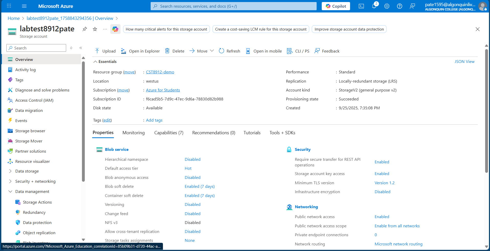
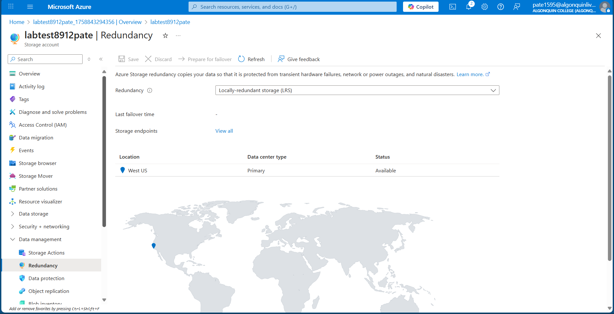
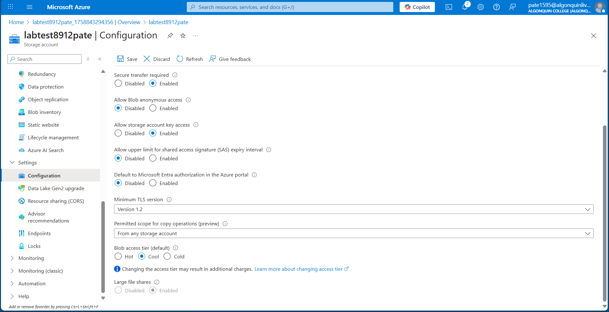
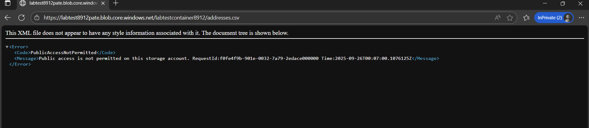
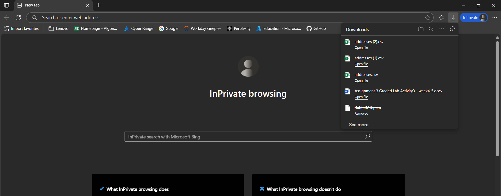
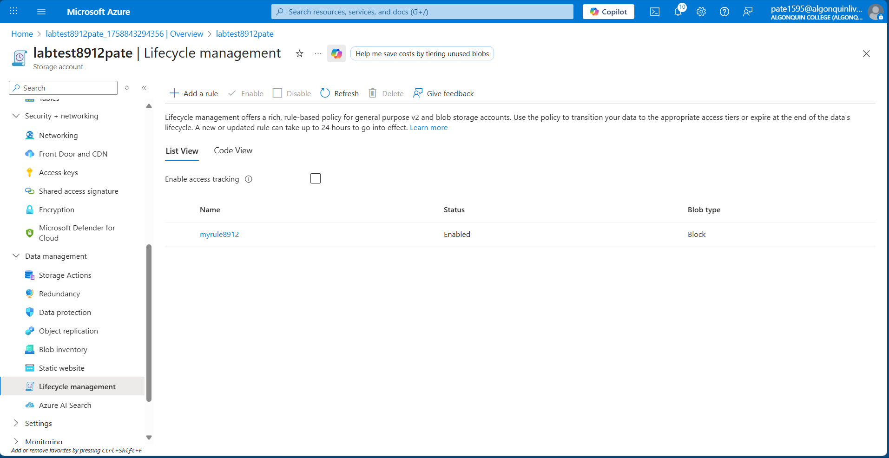

# Lab3  Report – Azure Storage Account & SAS

## 1. Storage Account Creation
I created a new Azure Storage Account named labtest8912pate inside the resource group CST8912-demo in the Canada Central region. The redundancy was initially set to Geo-redundant storage (GRS). This ensures multiple copies of data are stored across regions for durability.

---

## 2. Redundancy and Access Tier
I modified the redundancy setting from GRS to LRS (Locally redundant storage) to reduce cost and store copies only within a single datacenter region.  
Then, I changed the default access tier for blobs to Cool, which is better for infrequently accessed data.

---

## 3. Container and Blob Upload
I created a container named labtestcontainer8912 and uploaded a sample file inside a folder called sampletest8912. While uploading, I set the blob’s access tier to Hot, so the file can be accessed frequently at lower latency.

---

## 4. Private Access Test
I copied the blob’s URL and tested it in an incognito browser window. Because the container is private by default, the file was not accessible without proper authentication. This demonstrates that Azure Storage restricts public access by default for security.

---

## 5. SAS Token Access Test
I generated a Shared Access Signature (SAS) for the blob with read permission and copied the SAS URL. When tested in an incognito browser, the file was successfully accessible. This shows how SAS tokens provide secure, time-limited access to private resources.

---

## 6. Lifecycle Management Rule
I created a lifecycle management rule named myrule8912. The rule automatically moves blobs that have not been modified for more than 15 days to the Cool tier. This helps optimize costs by moving older data to a cheaper storage tier.

---

## 7. Cleanup
After completing the lab, I deleted the storage account and other resources under the resource group CST8912-demo to avoid ongoing charges.
