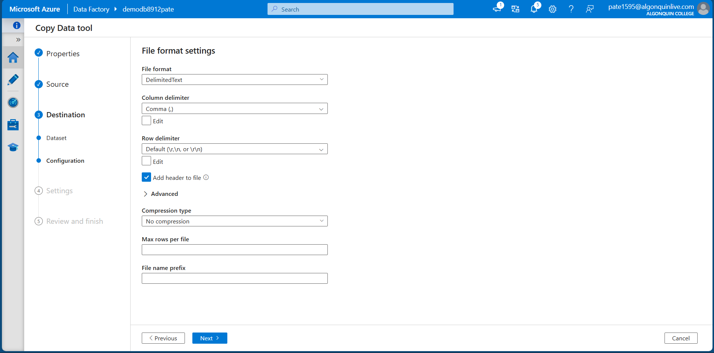

# CST8912 – Lab4
**Goal:** Copy sample data from Azure SQL Database to Azure Blob Storage using Azure Data Factory (Copy Data tool).  
**Student:** Jigarkumar Patel <br> **Course:** CST8912 

---

## Objective 
Create a SQL Database with sample data, run two SELECT queries, then use Azure Data Factory to copy the `SalesLT.Product` table into a Blob Storage container as a CSV-style file.


---

## Steps I followed
1. **Create SQL DB**
   - Made database `db8912`.
   - Kept Public endpoint on and allowed my client IP.
   - Chose Use existing data → Sample so the tables are preloaded.
   - Opened Query editor (preview) and signed in with the server admin account.

2. **Run queries**
   ```sql
   SELECT ProductID, Name, ListPrice, ProductCategoryID
   FROM SalesLT.Product;

   SELECT p.ProductID, p.Name AS ProductName,
          c.Name AS Category, p.ListPrice
   FROM SalesLT.Product AS p
   JOIN [SalesLT].[ProductCategory] AS c
     ON p.ProductCategoryID = c.ProductCategoryID;
   ```
3. **Create Storage + Container**
   - Created a storage account.
   - Added container `productdata8912`.

4. **Copy with Azure Data Factory**
   - Opened ADF Studio → Ingest (Copy Data tool).
   - **Source**: Azure SQL Database → connected to `db8912 → selected table SalesLT.Product`.
   - **Destination**: Azure Blob Storage → container `productdata8912`.
   - **File format**: DelimitedText, delimiter Comma (,), Add header = true, No compression.
   - Run the copy and checked the container.


---

## Screenshots

1. **SQL Database – Overview (db8912)**  
   

2. **Storage Account – Overview (demo8912pate)**  
   

3. **Storage Account – Containers (productdata8912)**  
   

4. **Data Factory – Overview (demodb8912pate)**  
   

5. **Data Factory – Copy Data tool**  
   

6. **Blob Container – productdata8912**  
   

---

