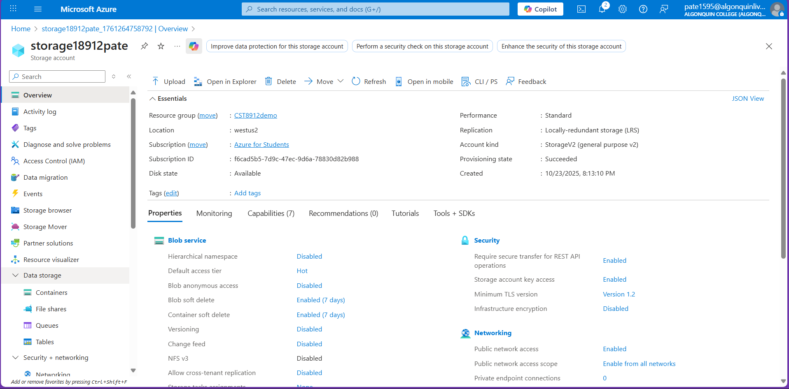
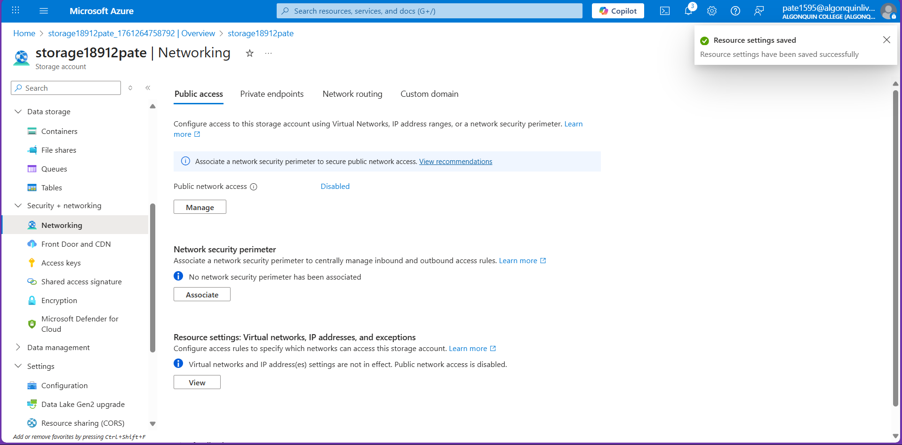
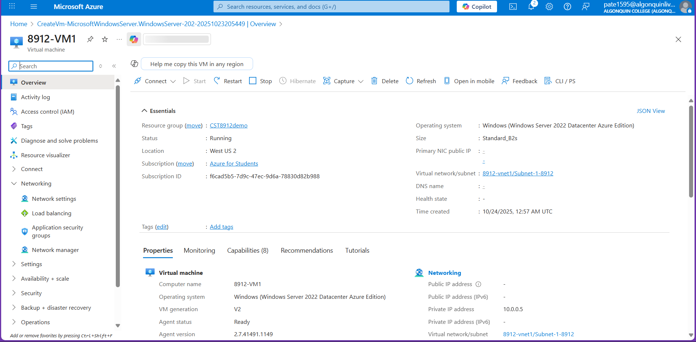
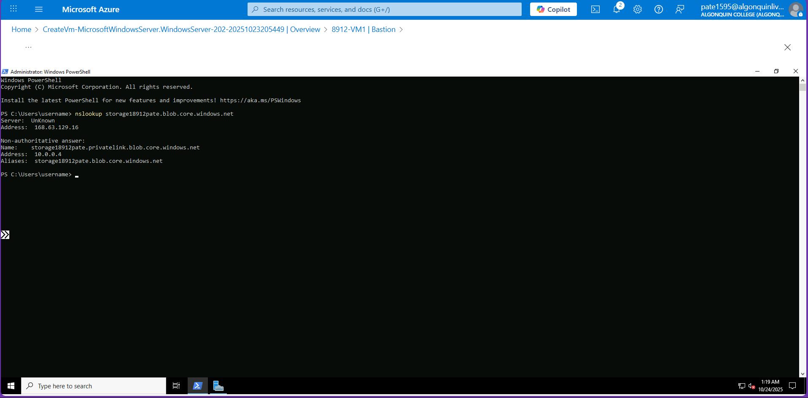
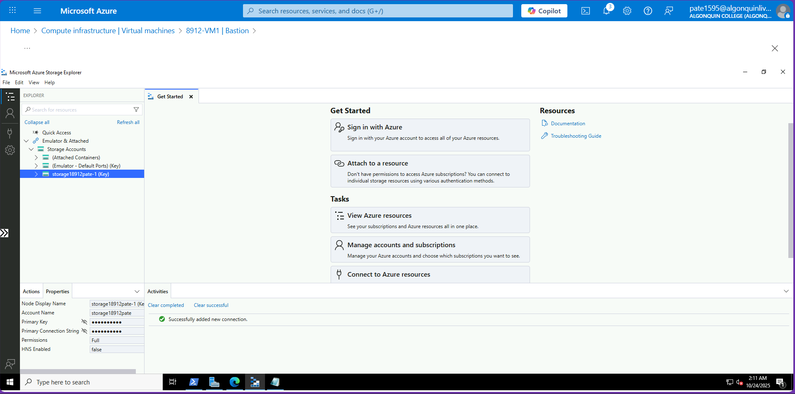

# CST8912 – Lab5
**Student:** Jigarkumar Patel   **Course:** CST8912 

---
---

##  Objective
This lab demonstrates how to create and configure **Azure Private Link** to provide private connectivity between a virtual network and an Azure Storage Account, ensuring all communication stays within the Microsoft network and never traverses the public internet.

---

## Step 1 – Create Virtual Network and Bastion Host
A virtual network (**`8912-vnet1`**) was created under the **CST8912demo** resource group in the **West US 2** region.  
Default IP configuration was used (10.0.0.0/16).  
Azure Bastion was enabled to securely connect to the VM through the Azure portal without using a public IP address.

**Configuration Details:**
- Azure Bastion Host Name: `Bastion8912`
- Azure Bastion Public IP: `(New) public-ip`

**Screenshot 1:** Virtual network overview after creation.  

**Screenshot 2:** Azure Bastion configuration showing Bastion8912 and public IP creation.  

---

## Step 2 – Create Storage Account
A storage account named **`storage18912pate`** was created in the **West US 2** region.

**Configuration Details:**
- Performance: Standard  
- Replication: Locally Redundant Storage (LRS)  
- Account Type: StorageV2 (general purpose v2)  
- Access Tier: Hot  

**Screenshot 3:** Storage account overview showing account name, region, and configuration.  

---

## Step 3 – Disable Public Network Access
To improve security, public network access was disabled for the storage account to ensure only private endpoints can connect.

**Steps:**
1. Navigate to **Security + networking > Networking**.  
2. Under **Public network access**, select **Disabled**.  
3. Click **Save**.

The change ensures that the storage account can only be accessed from within the private Azure network.

**Screenshot 4:** Public network access set to “Disabled.”  

---

## Step 4 – Create Private Endpoint
A **Private Endpoint** was created to establish a private connection between the VNet and the storage account.

**Configuration Details:**
- Name: `Privateendpoint-8912`
- Resource Type: `Microsoft.Storage/storageAccounts`
- Target Resource: `storage18912pate`
- Sub-resource: `blob`
- Virtual Network/Subnet: `8912-vnet1 / Subnet-1-8912`
- Connection Status: Approved (Auto-Approved)

**Screenshot 5:** Private endpoint overview showing successful connection and approval status.  

---

## Step 5 – Create Virtual Machine
A **Windows Server 2022 VM** named **`8912-VM1`** was deployed in the same virtual network for testing.

**Configuration Details:**
- Size: `Standard_B2s`
- Authentication: Username and Password
- Public IP: None
- Virtual Network/Subnet: `8912-vnet1 / Subnet-1-8912`

The VM uses Azure Bastion for secure access without exposing public IPs.

**Screenshot 6:** Virtual machine overview showing internal private IP and network configuration.  

---

## Step 6 – Create Blob Container
Inside the storage account, a **container** was created to store blobs privately.

**Configuration Details:**
- Container Name: `container`
- Public Access Level: Private (no anonymous access)

**Screenshot 7:** Blob container created successfully with private access level.  

---

## Step 7 – Test Private Link Connectivity
To verify that the private endpoint works, a DNS lookup was performed inside the VM (connected through Bastion).

**PowerShell Command:**
nslookup storage18912pate.blob.core.windows.net

**Screenshot 8:**  PowerShell window showing the nslookup result that returns the private IP address for the Azure Storage account.  

---

## Step 8 – Verify Connection via Azure Storage Explorer

To confirm end-to-end private connectivity, **Microsoft Azure Storage Explorer** was installed and launched inside the virtual machine.  
The storage account connection was added using the **connection string** copied from **Access Keys (key1)**.

After connecting, the storage account and its private container appeared under **Storage Accounts**, confirming secure access through the private endpoint.

This verifies that the VM can access Azure Storage using Azure Private Link without internet exposure.

**Screenshot 9:** Azure Storage Explorer showing the connected storage account and accessible private container.  

---

## Step 9 – Clean Up Resources

After successful testing, all resources were deleted to prevent unnecessary usage and costs.

