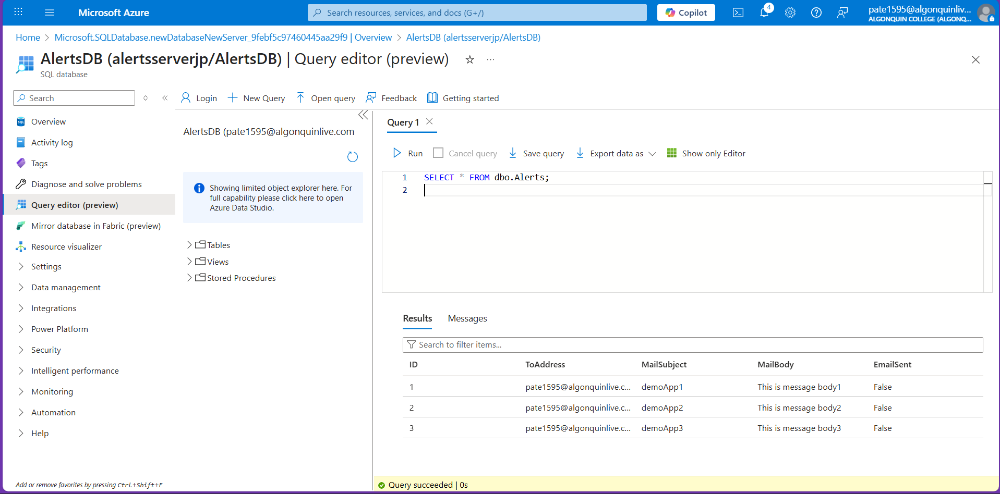
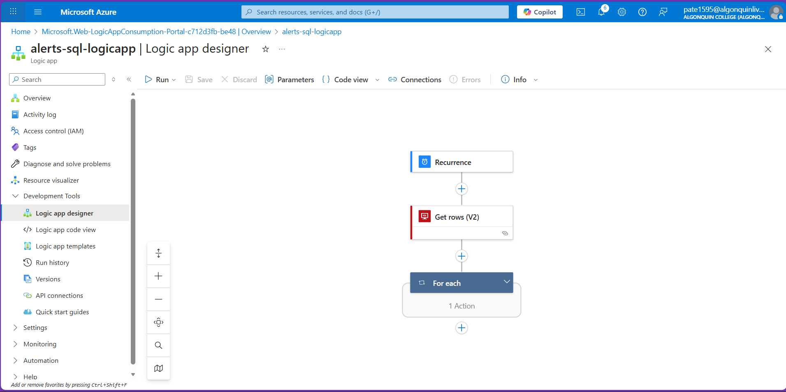
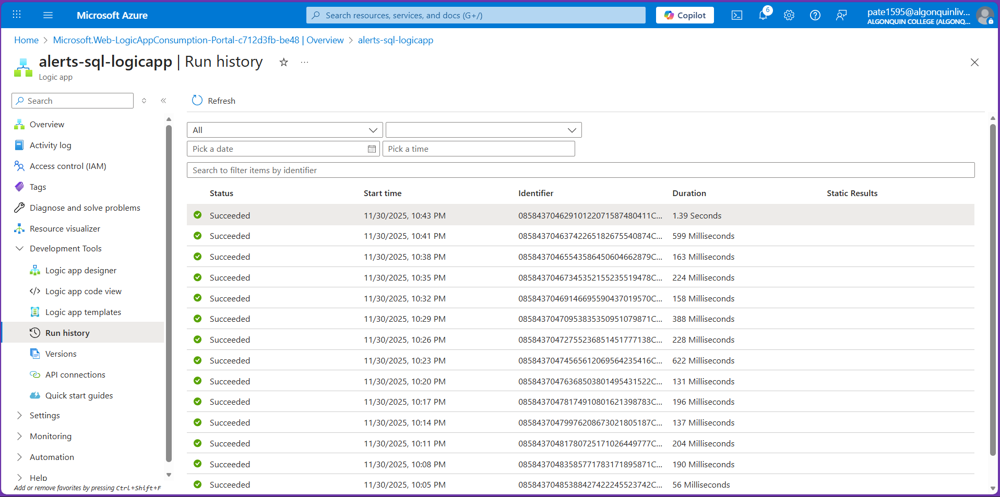
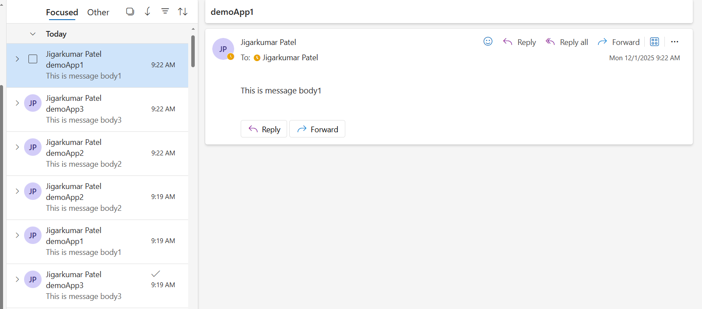
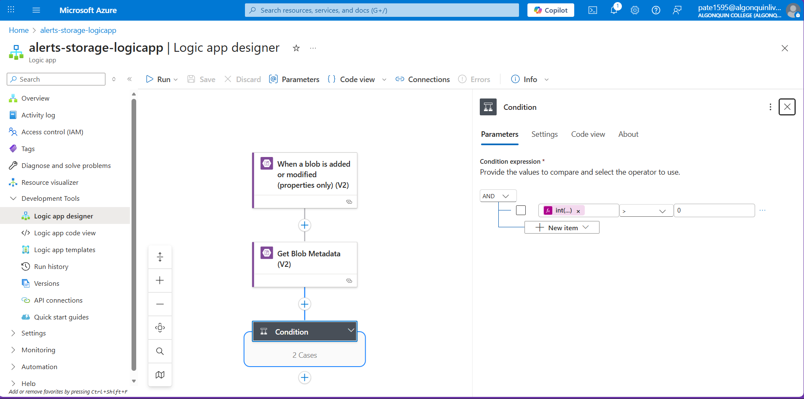
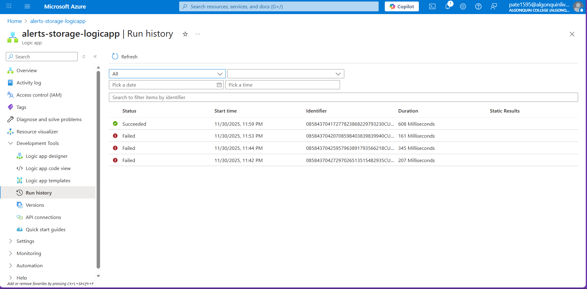
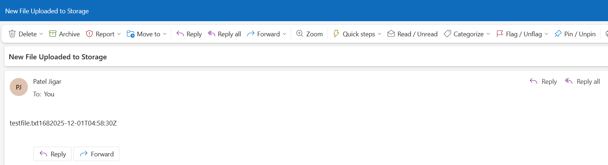

# CST8912 – Cloud Solution Architecture  
## Lab 10 

**Student Name:** Jigarkumar Patel    

---

# Task 1 – SQL Alerts and Email Notification (Logic App)

For this task, I used an Azure Logic App connected with an Azure SQL Database and Outlook email. The database already contained three records with email addresses, subjects, and message body text. I verified the table data first using a SQL query.

## SQL Data Verification

I opened the query editor in Azure SQL Database and ran a SELECT query on the Alerts table. The table showed three rows with different subjects and message body values.

---

## Logic App Structure

The Logic App was already created and contains the following main flow:
- A Recurrence trigger to run automatically
- Get rows (V2) action to read data from the Alerts table
- A For each loop to process each row

This ensures that every record in the database is checked during each run.

---

## Logic App Run History

After running the Logic App, I checked the run history section. All executions showed a successful status, which confirms that the workflow is running properly without errors.

---

## Email Notification Output

When the Logic App runs, it sends emails using the data from the SQL table. The subject and body of the email match the values stored in the database. The email below shows that the message body was successfully delivered.

---

This confirms that the SQL data is being read correctly and that the Logic App is able to send emails based on the database records.

## Task 2 – Storage Container Email Alert using Logic App

For this task I created a Logic App that sends me an email whenever a new file is uploaded to my storage container.

First I added the trigger **When a blob is added or modified (properties only) V2** and connected it to my storage account. After that I added **Get Blob Metadata (V2)** so the Logic App can read the file details like name, size, and last modified time.

Then I added a **Condition** to check if the uploaded file size is greater than zero. At first the Logic App failed because the comparison was using the wrong data type. I fixed the error by converting the file size to an integer using the **int()** function and then comparing it with `0`. After this fix the condition worked correctly.

Inside the **True** condition I added the action **Send an email (V2)**.  
I entered my email address in the **To** field.  
The subject was set to **New File Uploaded to Storage**.  
In the body I added dynamic values for file name and last modified time.

After saving the Logic App I uploaded a test file to the storage container. The run history shows that the latest execution was successful while the earlier ones had failed due to the condition error.

Once the run succeeded I received an email with the subject **New File Uploaded to Storage** and the file name in the message body. This confirms that the storage alert is working correctly.

