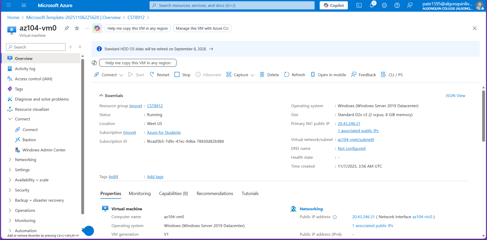
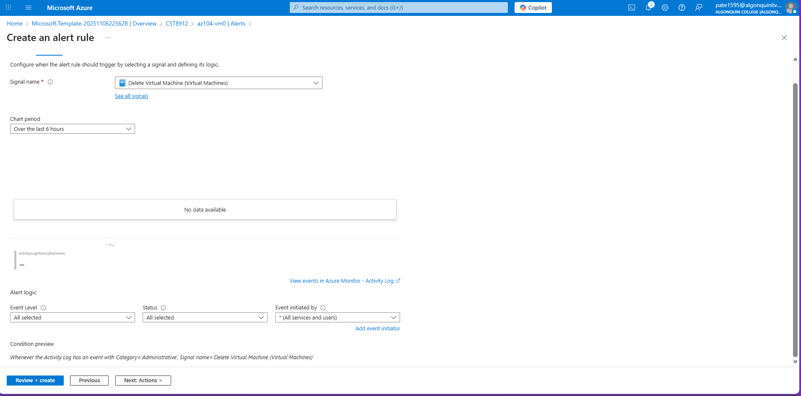
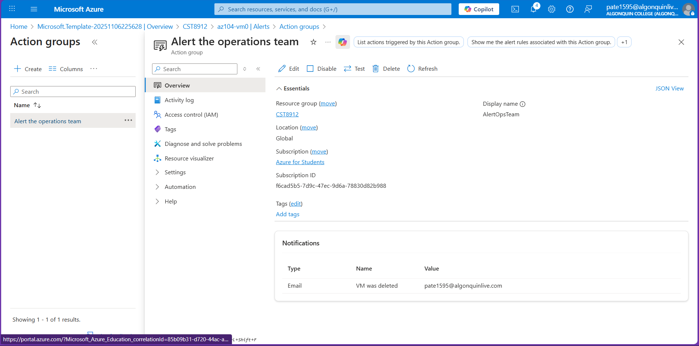
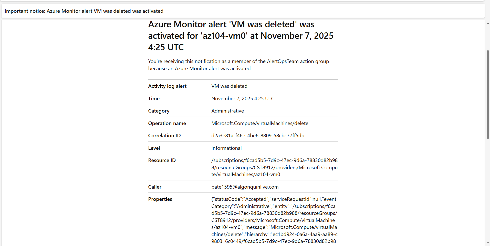
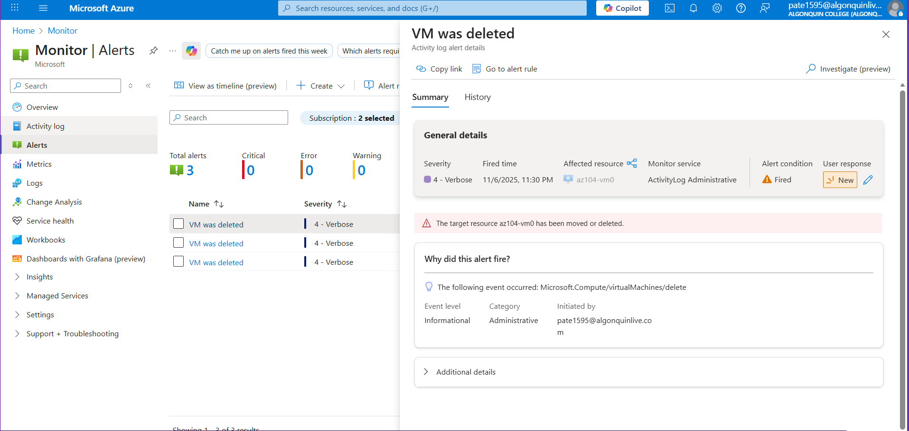
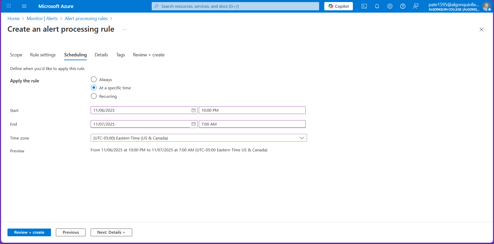
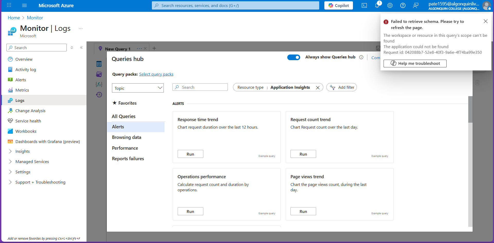
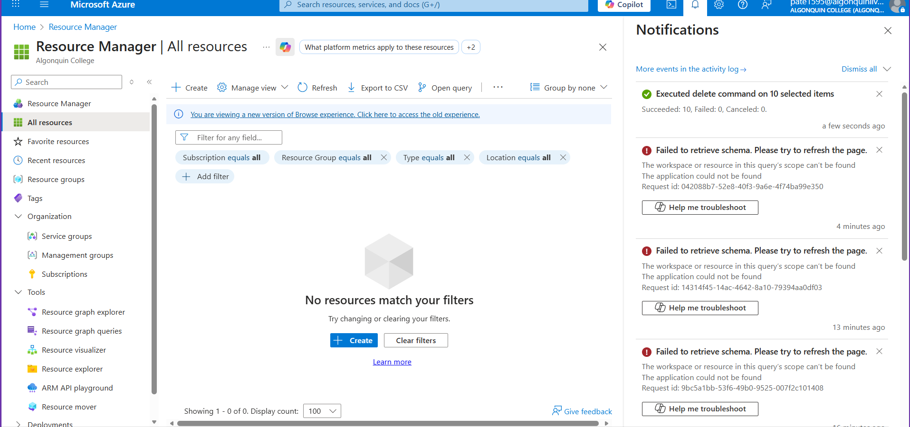

# CST8912 – Cloud Solution Architecture  
## Lab 7

**Student Name:** Jigarkumar Dilipkumar Patel  

---

## Task 1 – Deploy Infrastructure Using Template
A virtual machine was deployed using the provided ARM template file `az104-11-vm-template.json`.  
Deployment was done through **Deploy a custom template → Load file → Review + Create**.

**Resource Configuration:**
- Resource Group: `CST8912`
- Region: Canada Central
- VM Name: `az104-vm0`
- Username: `localadmin`
- OS: Windows Server 2019 Datacenter
- Status: Running

**Screenshot:**  

---

## Task 2 – Create an Alert
An alert rule was created to trigger when a virtual machine is deleted.

**Steps:**
1. Navigate to **Monitor → Alerts → + Create → Alert rule**.  
2. Set **Scope** to the resource group `CST8912`.  
3. Under **Condition**, choose **Delete Virtual Machine (Virtual Machines)** as the signal.  
4. Leave **Event Level** and **Status** as “All”.  
5. Click **Next: Actions**.

**Screenshot:**  

---

## Task 3 – Configure Action Group Notification
An **Action Group** was configured to send an email when the alert triggers.

**Configuration Details:**
- Action Group Name: `Alert the operations team`
- Display Name: `AlertOpsTeam`
- Notification Type: `Email`
- Recipient: `pate1595@algonquinlive.com`

**Screenshot:**  

---

## Task 4 – Trigger and Confirm Alert
To test, the virtual machine `az104-vm0` was deleted manually.  
Azure Monitor generated the configured alert and sent a confirmation email.

**Screenshots:**  
- Email notification received confirming alert trigger  
  

- Azure Portal showing the triggered alert details  
  

---

## Task 5 – Configure Alert Processing Rule
An alert processing rule was created to suppress notifications during planned maintenance hours.

**Configuration:**
- Rule Name: `Planned Maintenance`
- Description: `Suppress notifications during planned maintenance`
- Schedule:  
  - Start: 10:00 PM  
  - End: 7:00 AM  
  - Time Zone: Eastern (US & Canada)

**Screenshot:**  

---

### Task 6 - Issue Encountered 

While accessing **Azure Monitor → Logs**, an error appeared:

> **Failed to retrieve schema. Please try to refresh the page.**  
> The workspace or resource in this query’s scope can’t be found.  
> The application could not be found.

This happened because the **Log Analytics workspace** or **Application Insights** instance associated with the virtual machine was automatically disconnected or deleted after the VM was removed.  
As a result, Azure Monitor could not retrieve the schema tables needed to run queries.  
Due to this issue, the **final KQL query and visualization** for the last task could not be completed.

**Screenshot:**  

---

## Task 7 – Resource Cleanup
After verifying that alerts and notifications were functioning correctly, all Azure resources related to this lab were deleted to avoid additional costs.  
Resource deletion was confirmed through **Resource Manager → All Resources**, showing no active items under the resource group `CST8912`.

**Screenshot:**  

---

