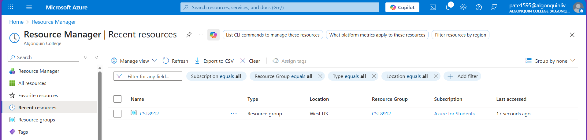
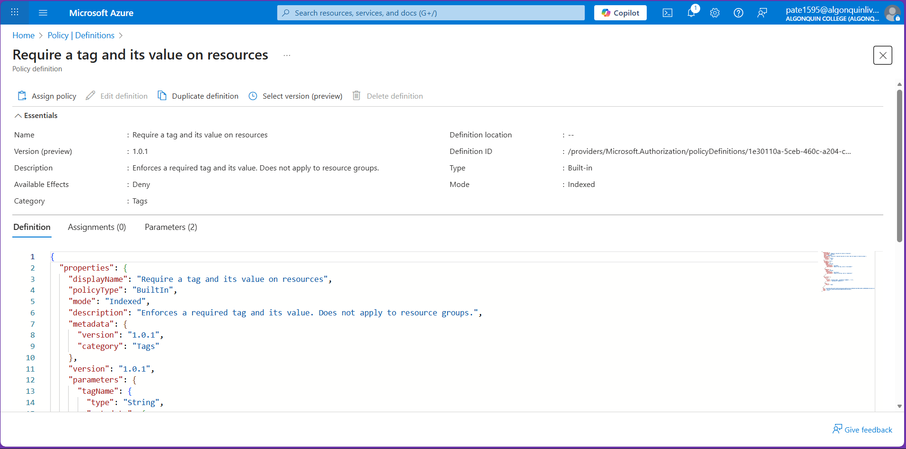
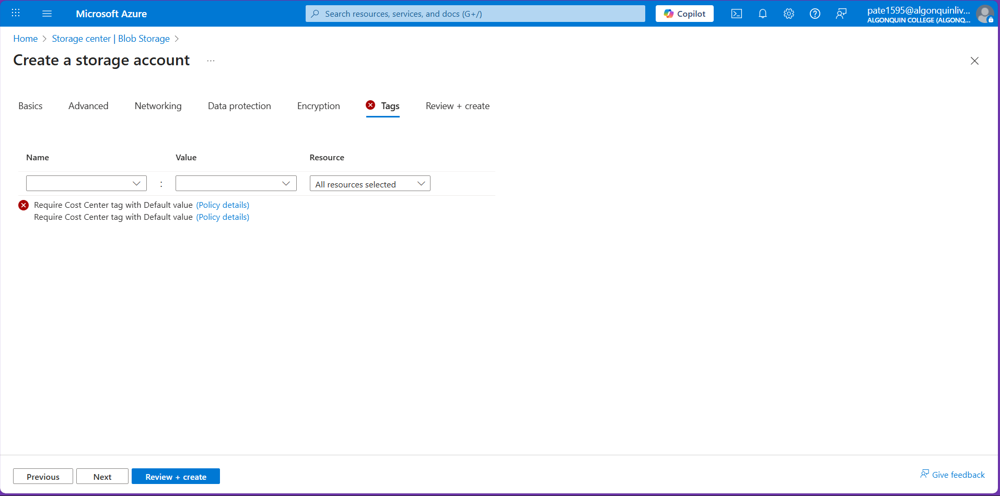
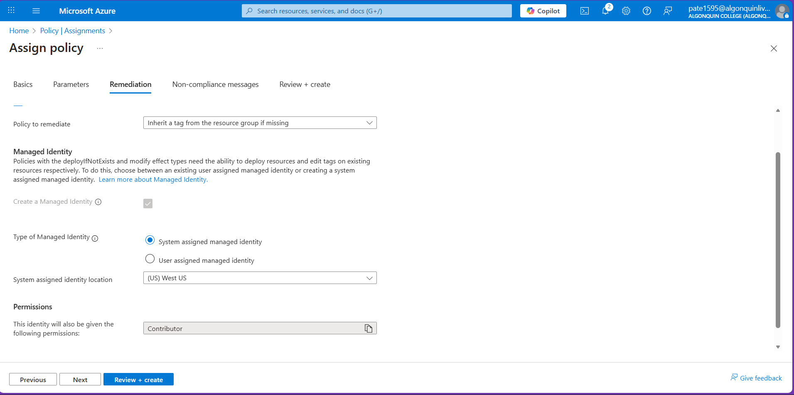
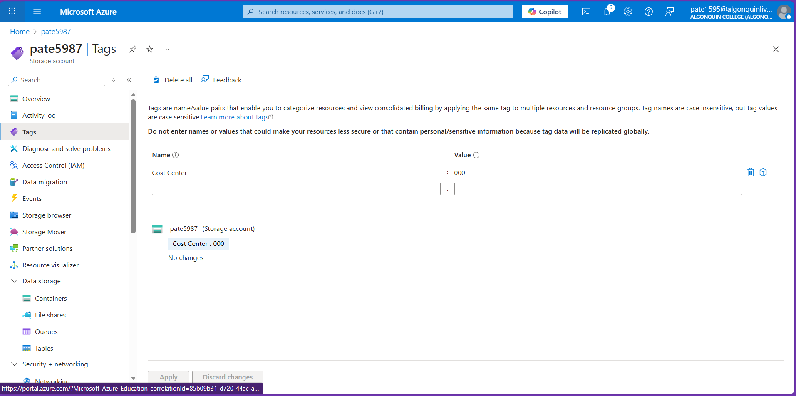
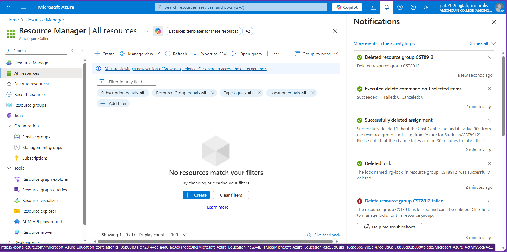

# CST8912 – Cloud Solution Architecture  
## Lab 8 – Tagging, Policy & Locks in Azure

**Student Name:** Jigarkumar Patel  
**Resource Group:** CST8912  

---

## **Task 1 – Apply a Tag on the Resource Group**

### **Steps Performed**
- Created resource group **CST8912** in **West US**  
- Added the tag:  
  - **Cost Center = 000**

### **Screenshot**

---

## **Task 2 – Enforce Tagging Using Azure Policy (Deny Policy)**

### **Steps Performed**
1. Opened **Policy → Definitions**  
2. Selected **“Require a tag and its value on resources”**  
3. Assigned the policy to **CST8912** with parameters:  
   - **Tag Name:** Cost Center  
   - **Tag Value:** 000  
4. Tried creating a Storage Account without tags policy blocked deployment.

### **Screenshot – Policy Blocking Tag Creation**

### **Screenshot – Policy Definition**

---

## **Task 3 – Apply Automatic Tagging (Inherit Policy)**

### **Steps Performed**
1. Deleted the deny policy assignment.  
2. Assigned **“Inherit a tag from the resource group if missing”** to **CST8912**.  
3. Enabled **Remediation Task** using a System Assigned Managed Identity.  
4. Created a new Storage Account without tags.  
5. Verified that the tag **Cost Center = 000** was automatically added.

### **Screenshot – Inherit Policy Assignment (Remediation Enabled)**

### **Screenshot – Tag Automatically Applied**

---

## **Task 4 – Resource Lock**

### **Steps Performed**
1. Created a **Delete Lock** named **rg-lock** on resource group **CST8912**.  
2. Attempted to delete the resource group.  
3. Deletion failed due to the lock confirming proper operation.

### **Screenshot – Delete Blocked by Lock**

---

## **Task 5 – Clean Up**

### **Steps Performed**
- Removed inherited tags from the storage account  
- Deleted the storage account  
- Removed the lock  
- Deleted the policy assignment  
- Deleted resource group **CST8912**

### **Screenshot – Cleanup Confirmation**

---

