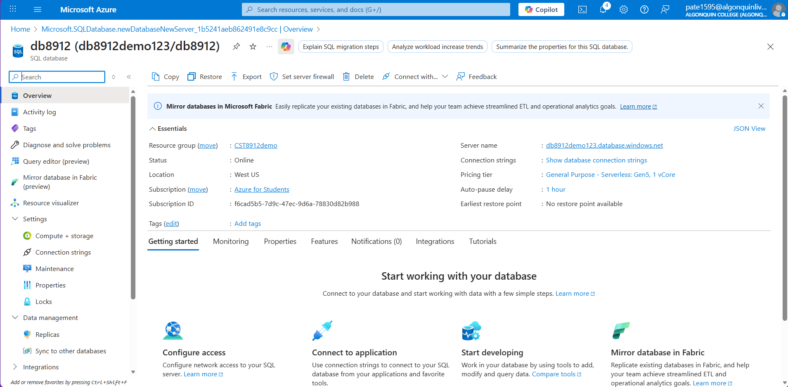
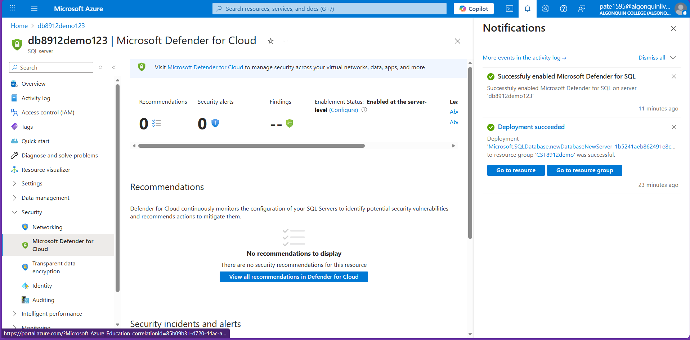
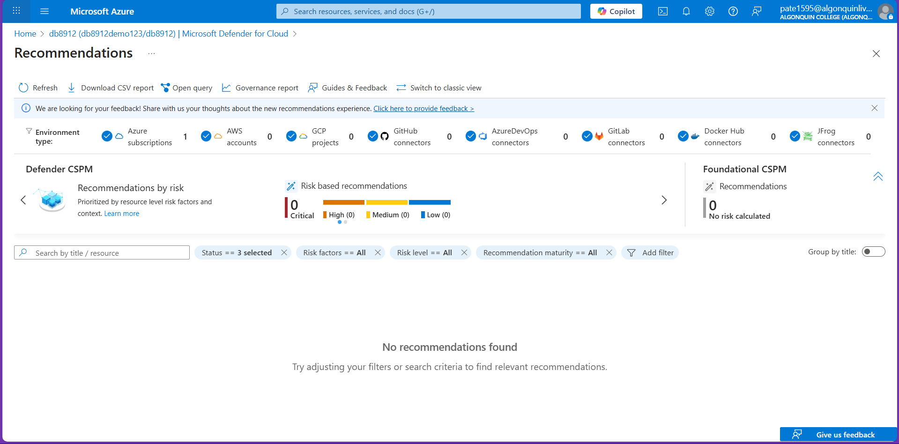
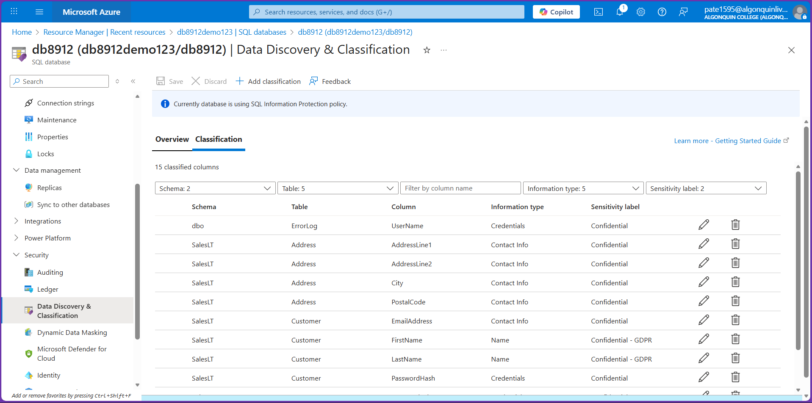
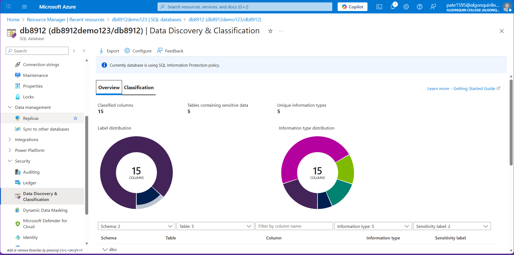
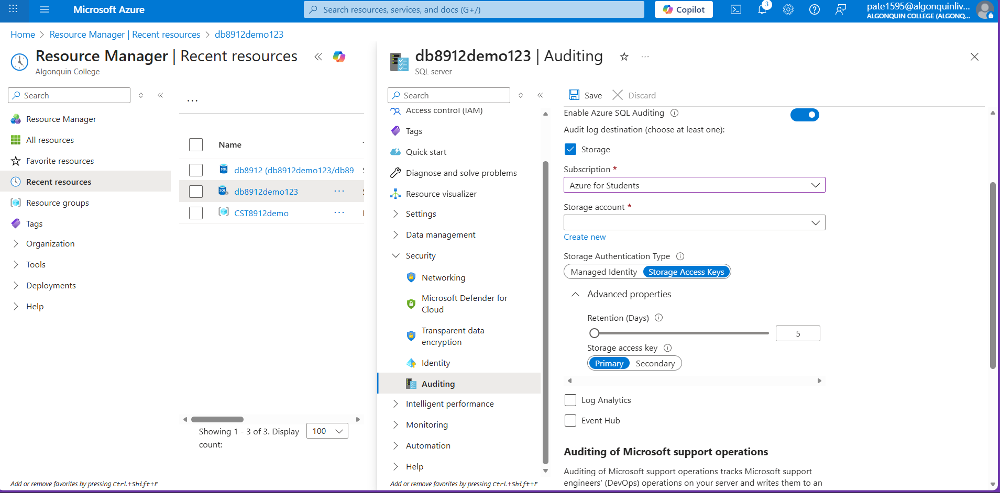
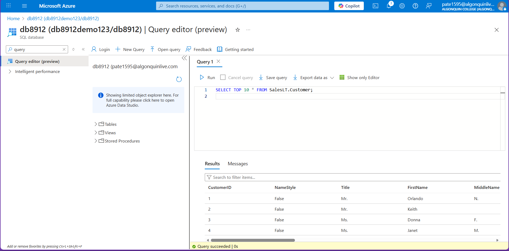
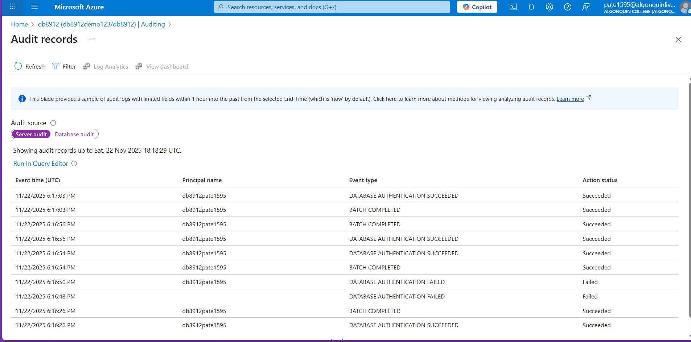
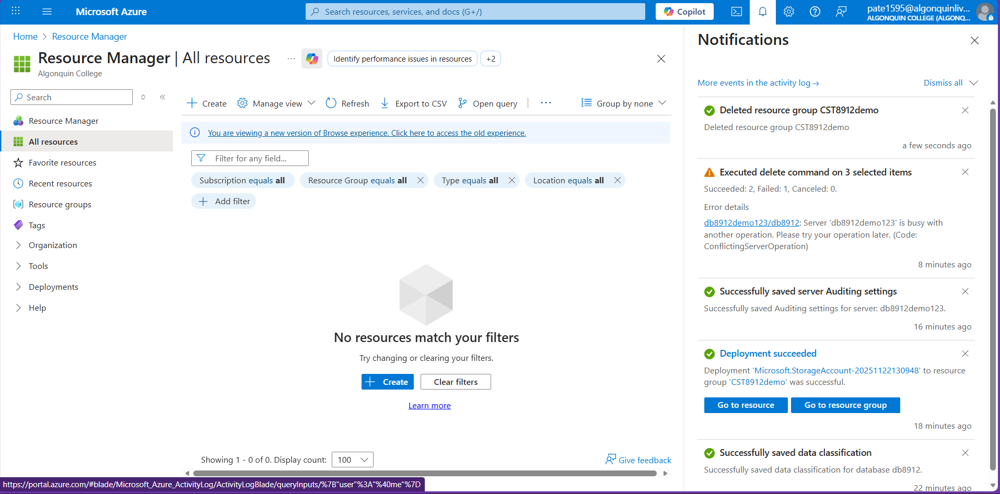

# CST8912 – Cloud Solution Architecture  
## Lab 9 – Azure SQL Database Security Features

**Student Name:** Jigarkumar Patel    

---

## Task 1 – Deploy an Azure SQL Database

### Steps Performed
- Created resource group **CST8912demo**  
- Deployed Azure SQL Database named **db8912**  
- Created SQL server **db8912demo123** in **West US**  
- Enabled Public endpoint and allowed Azure services plus client IP  
- Loaded sample data for testing  
- Confirmed database is **Online**

### Screenshot – SQL Database Overview

---

## Task 2 – Configure Advanced Data Protection

### Steps Performed
1. Opened SQL Server and went to **Microsoft Defender for Cloud**  
2. Enabled **Microsoft Defender for SQL**  
3. Reviewed **Recommendations** and **Security Alerts**  
4. Confirmed Defender is active at server level

### Screenshot – Microsoft Defender Enabled

### Screenshot – Recommendations View

---

## Task 3 – Configure Data Classification

### Steps Performed
1. Opened **Data Discovery & Classification** on db8912  
2. Reviewed detected sensitive columns  
3. Accepted all **15 recommended classifications**  
4. Saved changes  
5. Verified updated classification overview

### Screenshot – Sensitive Columns Identified

### Screenshot – Classification Overview Updated

---

## Task 4 – Configure Auditing

### Steps Performed
1. Enabled **Server Level Auditing**  
2. Created new storage account for audit logs  
3. Set **Retention = 5 days**  
4. Database auditing inherited server settings  
5. Used Query Editor to:
   - Attempt wrong password  
   - Log in successfully  
   - Run SQL query  
6. Viewed audit logs and verified events

### Screenshot – Server Auditing Enabled

### Screenshot – Query Executed to Generate Logs

### Screenshot – Audit Log Records

---

## Task 5 – Clean Up Resources

### Steps Performed
- Deleted SQL database **db8912**  
- Deleted SQL server **db8912demo123**  
- Deleted audit storage account  
- Deleted resource group **CST8912demo**

### Screenshot – Cleanup Confirmation

---
